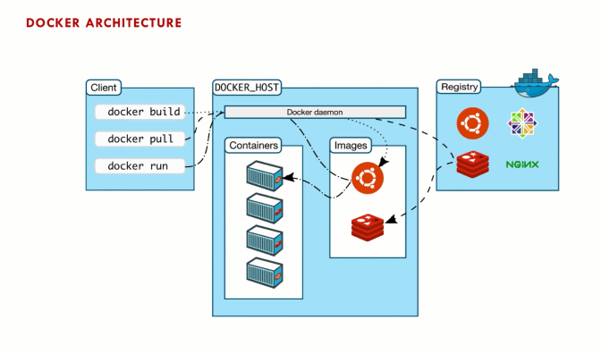

# Docker Architechture

Before running Docker commands, it's crucial to understand its architecture and how things work. Docker's architecture is divided into three main components:

1.  **Client**
2.  **Host**
3.  **Registry**

#### 1\. Docker Client

The Docker Client is where you run your Docker commands. It interacts with the Docker daemon through REST APIs. These commands include:

- `docker version`
- `docker run`
- `docker build`

The client sends these commands to the Docker daemon, which processes them.

#### 2\. Docker Host

The Docker Host runs the Docker daemon (`dockerd`), which is responsible for managing Docker containers. On Linux, the Docker daemon runs directly on the OS. However, on macOS, Docker Desktop uses a lightweight Linux VM via a hypervisor to run the daemon.

##### Key Components on the Docker Host:

- **Docker Daemon (`dockerd`)**: The core service responsible for creating and managing Docker containers.
- **Containers**: Lightweight, isolated environments created from Docker images.
- **Images**: Read-only templates used to create containers.

#### 3\. Docker Registry

A Docker Registry is a repository for Docker images. The default registry is Docker Hub, where you can find and share images. You can pull images from the registry using commands like `docker pull`.

##### Key Functions:

- **Store Images**: Holds various Docker images.
- **Retrieve Images**: Allows you to pull images to your local environment.

### Understanding the Interaction

Let's walk through the interaction between these components with a practical example:

1.  **Pulling an Image**:

    - **Command**: `docker pull mysql`
    - **Client**: Sends a pull request to the Docker daemon.
    - **Daemon**: Contacts the Docker Registry (e.g., Docker Hub) to fetch the `mysql` image.
    - **Registry**: Provides the image to the daemon.
    - **Host**: Stores the image locally.

2.  **Running a Container**:

    - **Command**: `docker run mysql`
    - **Client**: Sends a run request to the Docker daemon.
    - **Daemon**: Uses the locally stored `mysql` image to create a new container.
    - **Host**: Launches the container using the image.

### Detailed Component Breakdown

1.  **Docker Client**:

    - **CLI**: Command Line Interface to interact with Docker.
    - **API Calls**: Communicates with the Docker daemon via REST APIs.

2.  **Docker Daemon**:

    - **Process Management**: Manages container lifecycle (create, start, stop, delete).
    - **Networking**: Manages container networking.
    - **Storage**: Manages data storage for containers.

3.  **Docker Registry**:

    - **Public Registries**: Docker Hub, Google Container Registry.
    - **Private Registries**: Can be set up for internal use within organizations.

### Diagram Explanation

Consider a diagram with the following flow:

1.  **Client Command**: `docker pull mysql`
    - Sent to the Docker daemon via API calls.
2.  **Daemon Request**: Fetches the image from the Docker Registry.
3.  **Registry Response**: Provides the image to the Docker daemon.
4.  **Container Creation**: Daemon creates a container using the fetched image.
5.  **Container Execution**: The container is now running on the Docker Host.

### Summary

To sum it up:

- **Docker Client**: Runs commands.
- **Docker Host**: Runs the Docker daemon, manages containers and images.
- **Docker Registry**: Stores and provides Docker images.

Understanding this architecture is crucial for effectively using Docker.
