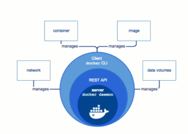

# Docker Engine

# Understanding Docker Engine

The Docker Engine is the backbone of Docker's architecture, enabling containerized applications to run seamlessly across various environments. This document provides a structured breakdown of its key components and functionality.

## What is Docker Engine?

Docker Engine is the core application that facilitates the creation, deployment, and management of containers.

### Components of Docker Engine

Docker Engine comprises three primary parts:

- **Docker Daemon (Server)**
- **REST API**
- **Docker Client (CLI)**

---

## Key Components of Docker Engine

### Docker Daemon

- **Role**: A server-side component that listens for Docker API requests and manages Docker objects (e.g., images, containers, networks).
- **Process**:
  - A long-running background process (often referred to as a "daemon").
  - Identified on the system using commands like `ps -aux | grep docker`.
- **Functionality**:
  - Handles the actual work of building, running, and managing Docker containers.
  - Facilitates the orchestration of images and containers.

### REST API

- **Purpose**: Provides an interface for communication between the Docker client and Docker daemon.
- **Functionality**:
  - Acts as a bridge, enabling programs to send requests to and interact with the Docker daemon.
  - Defines endpoints to execute Docker commands programmatically.

### Docker Client (CLI)

- **Role**: The entry point for users to interact with Docker.
- **Commands**:
  - Examples include `docker run`, `docker build`, `docker push`, `docker start`, etc.
- **Interface**:
  - Typically accessed via the command-line interface (CLI).
  - Sends commands to the Docker daemon through the REST API.

---

## Key Features of Docker Engine

### Portability

- Docker Engine enables containers to run anywhere, whether on local machines, public cloud providers (e.g., AWS, Azure, Oracle Cloud), or on-premises data centers.
- **Example**: A container created on AWS can be seamlessly migrated to Oracle Cloud or an on-premises server.

### Multi-Platform Support

- Initially designed for Linux, Docker Engine now supports multiple operating systems, including:
  - **Linux Distributions**: CentOS, Debian, Fedora, Oracle Linux, Red Hat Linux.
  - **Windows**: Available for Windows operating systems.
  - **MacOS**: Runs via a virtualized Linux environment in the background, as Docker relies on Linux kernel features.

### Editions Available

- **Community Edition (CE)**: Free and suitable for personal or small-scale projects.
- **Enterprise Edition (EE)**: Paid version offering advanced features, support, and security for large organizations.

---

## How Docker Engine Works

### Workflow

1. The Docker Client sends commands (e.g., `docker run`) to the Docker Daemon via the REST API.
2. The Docker Daemon processes the commands, creating or managing Docker objects like containers or images.

**Example**:

- Command: `docker run ubuntu`
- The Docker Client sends a request to the Docker Daemon to run an Ubuntu container.
- The Docker Daemon fetches the required image (if not already available locally) and starts the container.

### Cross-Environment Portability

- Containers can be created on one environment (e.g., Linux) and shipped to another (e.g., Windows) without compatibility issues.

---

## Real-World Applications

### Cloud Migrations

- Containers created in one cloud (e.g., AWS) can be migrated to another cloud (e.g., Oracle Cloud) or on-premises systems effortlessly.

### Development Environments

- Developers can use Docker Engine to simulate production environments locally, ensuring consistency across development and deployment stages.

### Enterprise Scalability

- Large organizations can leverage the Enterprise Edition to manage containerized workloads at scale, ensuring reliability and security.

---

## Summary

- **Docker Engine**: The foundational layer of Docker for creating, deploying, and managing containers.
- **Components**: Docker Daemon, REST API, Docker Client.
- **Key Features**: Portability, multi-platform support, scalability.
- **Editions**: Available as a free Community Edition and a paid Enterprise Edition.

By leveraging Docker Engine, users can build, ship, and run applications consistently across diverse environments, making it an indispensable tool for modern software development and deployment.
