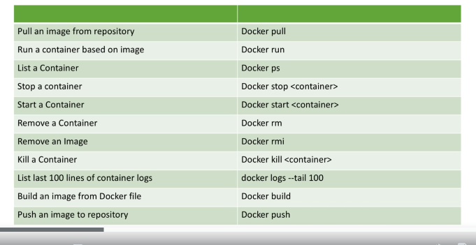
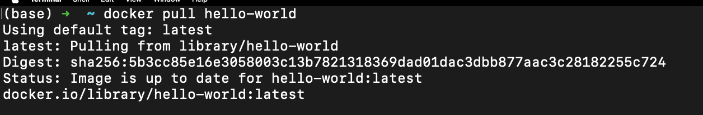

# Docker Commands

1.  docker pull hello-world
    

2.  docker images

3.  docker run hello-world

4.  docker run ubuntu

5.  docker ps

    - Shows all the container that are running

6.  docker ps -1

    - Shows all the container either stopped or running

7.  docker run -d ubuntu sleep 100

    - d is for detached mode which gives the terminal back.
    - the ubuntu run command ended before because it didnt have any instructions to run

8.  docker stop <container-id>

9.  docker rm <container-id>

    - Please note that removing container does not remove images.

10. docker images

11. docker rmi ee301c921b8a --force

### Summary of Learnings

#### **1\. Basic Docker Commands and Concepts**

- **Docker CLI Basics**:
  - `docker --help`: Lists all available Docker commands and their descriptions.
  - `docker <command> --help`: Provides detailed help for specific commands.

#### **2\. Working with Docker Images**

- **Pulling Images**:

  - `docker pull <image>`: Pulls the specified image from Docker Hub or another registry.
  - Default tag: `latest` (if no specific tag is provided).

- **Listing Images**:

  - `docker images`: Displays all downloaded images with details (repository, tag, image ID, size).

- **Removing Images**:

  - `docker rmi <image_id>`: Deletes an image from the local machine.

#### **3\. Working with Docker Containers**

- **Creating and Running Containers**:

  - `docker run <image>`: Creates and runs a container from the specified image.
  - `docker run -d <image>`: Runs the container in detached mode (background).
  - `docker run <image> sleep <time>`: Runs a container with a specified command (e.g., `sleep`).

- **Listing Containers**:

  - `docker ps`: Lists all running containers.
  - `docker ps -a`: Lists all containers, including stopped/exited ones.

- **Stopping Containers**:

  - `docker stop <container_id>`: Stops a running container.

- **Removing Containers**:

  - `docker rm <container_id>`: Deletes a stopped container. You can use partial IDs for convenience.

#### **4\. Docker Command Workflow**

- **Hello World Example**:
  - Docker client sends commands to the Docker daemon.
  - Docker daemon pulls the required image (if not locally available).
  - Docker daemon creates a container from the image and executes the application.
  - Output is returned to the Docker client.

#### **5\. Key Observations**

- A **container** is a runnable instance of an **image**.
- You can directly run an image without explicitly pulling it; Docker handles the pull automatically.
- Containers with no active process or task exit immediately.
- Each container and image is assigned a unique ID.
- Docker assigns random names to containers for better readability.

#### **6\. Additional Tips**

- **Clean-up Best Practices**:
  - Regularly remove unused containers and images to save disk space.
  - Use `docker rm` for containers and `docker rmi` for images.
