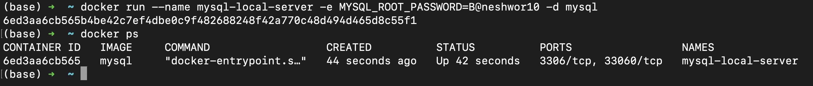

## Setting up Mysql

docker pull mysql

docker pull mysql/mysql-server

docker run --name mysql-local-server -e MYSQL_ROOT_PASSWORD=B@neshwor10 -d mysql

docker exec -t mysql-local-server bash
// Pleae log me into the shell for this container.
