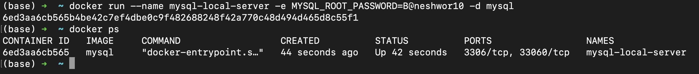

## Setting up Mysql

docker pull mysql

docker pull mysql/mysql-server

docker run --name mysql-local-server -e MYSQL_ROOT_PASSWORD=B@neshwor10 -d mysql

docker exec -t mysql-local-server bash
// Pleae log me into the shell for this container.

When you work with a Docker container, you're essentially dealing with a "self-contained mini-computer" running inside your computer. This mini-computer has its own environment, file system, and running processes. Here's why you need to log in to the shell for the container instead of directly interacting with your Mac's shell:

---

### **1\. Containers Are Isolated**

- A Docker container, like `mysql-local-server`, is isolated from your host system (your Mac). It runs its own operating system and has its own environment.
- The MySQL database you're running inside the container isn't directly accessible through your Mac's terminal because your Mac's shell (e.g., zsh) operates in your Mac's environment, not the container's.

---

### **2\. The MySQL Server Lives Inside the Container**

- When you use Docker, the MySQL server is installed _inside the container_, not on your Mac.
- To interact with this MySQL server, you need to "step into" the container where the server is running. Logging into the container's shell with `docker exec -t mysql-local-server bash` is like entering its mini-computer to work directly with its environment.

---

### **3\. Host and Container Differences**

- **Your Mac's zsh shell**: It doesn't have the MySQL server running, so it can't directly interact with the database.
- **Container's bash shell**: This shell exists inside the container where MySQL is installed. Once you're inside, you can directly interact with the MySQL server using commands like `mysql -u root -p`.

---

### **Why Can't the Mac's Shell Work for MySQL?**

While you can't directly interact with the MySQL server in the container from your Mac's zsh shell, you can **indirectly connect to it** if:

1.  The container's MySQL server is configured to expose its port to your Mac.
2.  You use a MySQL client (CLI or GUI) on your Mac and connect to the container's database using its IP address or hostname.

For example:

bash

Copy code

`mysql -h 127.0.0.1 -P 3306 -u root -p`

This assumes MySQL is running in the container and Docker maps port 3306 from the container to your host machine.

---

### **Foundation Concepts**

1.  **Docker Containers**: Think of them as lightweight, portable virtual machines. Each container has its own operating system and environment.
2.  **Isolation**: Containers don't share their environments directly with your Mac, which keeps them secure and portable.
3.  **Networking**: To connect to a service (like MySQL) running inside a container from your Mac, you need proper network setup (like port mapping).

---

### **In Summary**

You need to log into the container's shell because that's where the MySQL server lives. Your Mac's shell doesn't directly interact with the container's isolated environment. However, with proper networking, you can access the MySQL server from your Mac's zsh shell without logging into the container.
